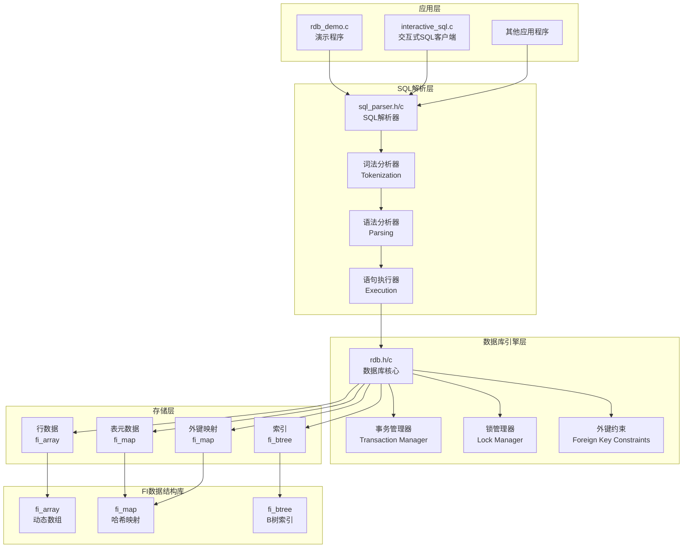
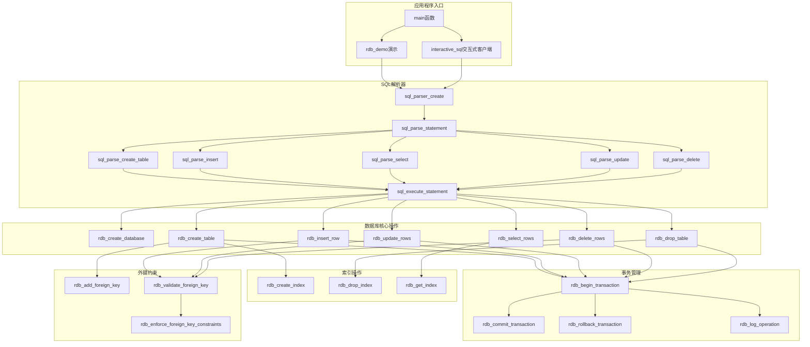
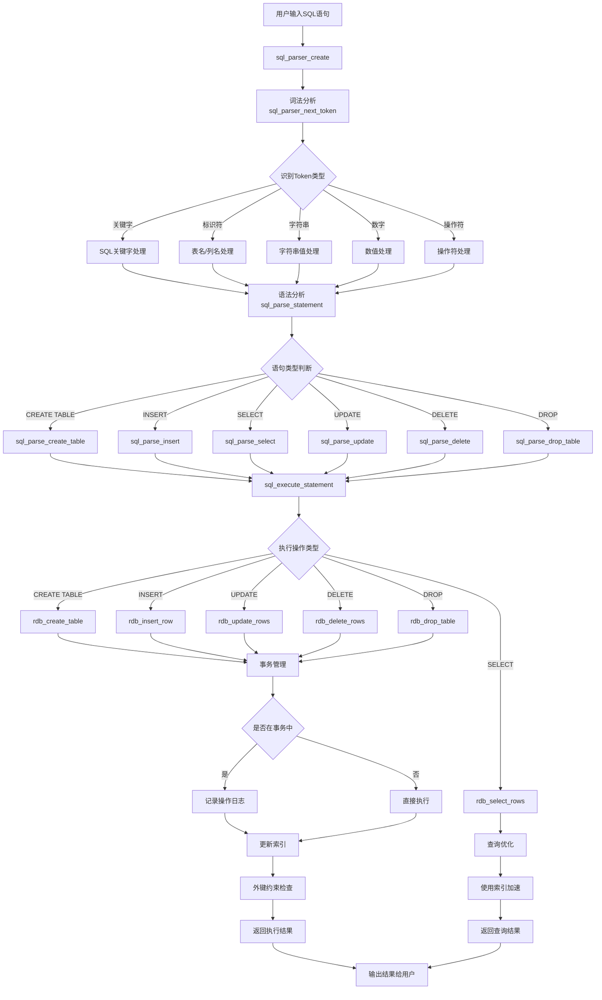
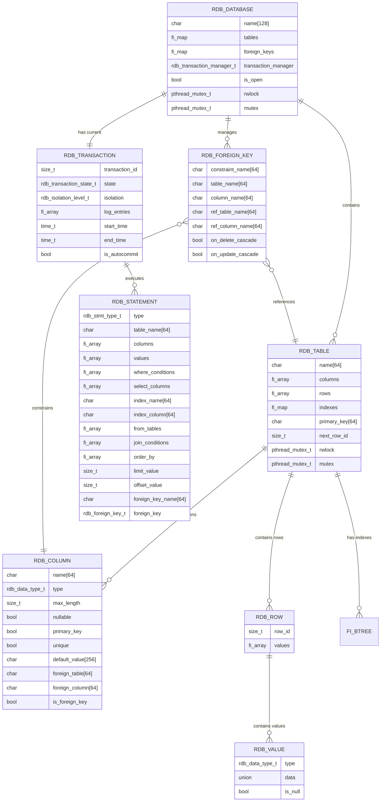

# FI 关系型数据库 (RDB)

这是一个基于 FI 数据结构库实现的简易关系型数据库系统，展示了如何使用 `fi_array`、`fi_map` 和 `fi_btree` 来构建一个功能完整的数据库引擎。

## 项目状态

本项目实现了一个完整的关系型数据库系统，包含以下核心组件：

1. **数据库引擎** (`rdb.h`, `rdb.c`) - 完整的关系型数据库实现
2. **SQL 解析器** (`sql_parser.h`, `sql_parser.c`) - 支持基本 SQL 语句解析
3. **演示程序** (`rdb_demo.c`) - 展示数据库功能的完整演示
4. **交互式 SQL 客户端** (`interactive_sql.c`) - 提供命令行界面进行 SQL 操作

该实现稳定可靠，适合学习和理解数据库系统的基本原理。

## 功能特性

### 核心功能
- **数据库管理**: 创建、打开、关闭数据库
- **表管理**: 创建、删除表，支持多种数据类型
- **数据操作**: INSERT、SELECT、UPDATE、DELETE
- **索引支持**: 基于 BTree 的索引系统
- **SQL 解析**: 支持基本 SQL 语句解析

### 支持的数据类型
- `INT` - 整数类型
- `FLOAT` - 浮点数类型
- `VARCHAR(n)` - 可变长度字符串
- `TEXT` - 长文本
- `BOOLEAN` - 布尔类型

### 支持的 SQL 语句
- `CREATE TABLE` - 创建表，支持列定义、主键、唯一约束
- `DROP TABLE` - 删除表
- `INSERT INTO` - 插入数据，支持多行插入
- `SELECT` - 查询数据，支持 WHERE 条件、ORDER BY、LIMIT
- `UPDATE` - 更新数据，支持 WHERE 条件
- `DELETE` - 删除数据，支持 WHERE 条件
- `CREATE INDEX` - 创建索引
- `DROP INDEX` - 删除索引
- `BEGIN TRANSACTION` - 开始事务
- `COMMIT` - 提交事务
- `ROLLBACK` - 回滚事务

### SQL 解析器特性
- **词法分析**: 完整的 SQL 词法分析器，支持关键字、标识符、字符串、数字、操作符
- **语法分析**: 支持复杂 SQL 语句的语法解析
- **操作符支持**: `=`, `!=`, `<`, `>`, `<=`, `>=`, `LIKE`, `IS`, `IN`
- **逻辑连接符**: `AND`, `OR`
- **数据类型**: 自动识别和转换数据类型
- **错误处理**: 详细的语法错误报告

## 架构设计

### 系统架构图



### 数据存储层
- **表元数据**: 使用 `fi_map` 存储表名到表结构的映射
- **行数据**: 使用 `fi_array` 存储表中的行数据
- **索引**: 使用 `fi_btree` 实现各种索引

### 核心组件
1. **rdb.h/rdb.c** - 数据库核心功能
2. **sql_parser.h/sql_parser.c** - SQL 解析器
3. **rdb_demo.c** - 演示程序

### 主要函数调用关系图



### SQL处理流程数据流图



### 核心数据结构关系图



### 内存布局图

```mermaid
graph TB
    subgraph "数据库实例 (rdb_database_t)"
        A[数据库名称<br/>char name[128]]
        B[表映射<br/>fi_map *tables]
        C[外键映射<br/>fi_map *foreign_keys]
        D[事务管理器<br/>rdb_transaction_manager_t*]
        E[读写锁<br/>pthread_mutex_t rwlock]
    end
    
    subgraph "表映射 (fi_map)"
        F[表名1 → rdb_table_t*]
        G[表名2 → rdb_table_t*]
        H[表名N → rdb_table_t*]
    end
    
    subgraph "表结构 (rdb_table_t)"
        I[表名<br/>char name[64]]
        J[列定义数组<br/>fi_array *columns]
        K[行数据数组<br/>fi_array *rows]
        L[索引映射<br/>fi_map *indexes]
        M[主键列名<br/>char primary_key[64]]
        N[行ID计数器<br/>size_t next_row_id]
    end
    
    subgraph "列定义数组 (fi_array)"
        O[rdb_column_t*]
        P[rdb_column_t*]
        Q[rdb_column_t*]
    end
    
    subgraph "行数据数组 (fi_array)"
        R[rdb_row_t*]
        S[rdb_row_t*]
        T[rdb_row_t*]
    end
    
    subgraph "行结构 (rdb_row_t)"
        U[行ID<br/>size_t row_id]
        V[值数组<br/>fi_array *values]
    end
    
    subgraph "值数组 (fi_array)"
        W[rdb_value_t*]
        X[rdb_value_t*]
        Y[rdb_value_t*]
    end
    
    subgraph "索引映射 (fi_map)"
        Z[索引名1 → fi_btree*]
        AA[索引名2 → fi_btree*]
    end
    
    subgraph "B树索引 (fi_btree)"
        BB[键值对存储<br/>支持范围查询]
    end
    
    A --> B
    B --> F
    B --> G
    B --> H
    
    F --> I
    I --> J
    I --> K
    I --> L
    I --> M
    I --> N
    
    J --> O
    J --> P
    J --> Q
    
    K --> R
    K --> S
    K --> T
    
    R --> U
    R --> V
    S --> U
    S --> V
    T --> U
    T --> V
    
    V --> W
    V --> X
    V --> Y
    
    L --> Z
    L --> AA
    
    Z --> BB
    AA --> BB
```

## 项目文件结构

```
examples/rdb/
├── README.md              # 项目文档
├── SUMMARY.md             # 项目总结
├── rdb.h                  # 数据库头文件
├── rdb.c                  # 数据库实现
├── sql_parser.h           # SQL 解析器头文件
├── sql_parser.c           # SQL 解析器实现
├── rdb_demo.c             # 演示程序
├── Makefile               # 构建文件
├── debug_map.c            # 调试工具
├── debug_test.c           # 调试测试
└── build/                 # 编译输出目录
    ├── rdb_demo           # 演示程序可执行文件
    ├── rdb.o              # 数据库对象文件
    ├── sql_parser.o       # SQL 解析器对象文件
    └── rdb_demo.o         # 演示程序对象文件
```

## 编译和运行

### 前提条件
确保 FI 库已经编译完成：
```bash
cd ../../src
make
```

### 编译和运行
```bash
# 编译项目
make

# 运行演示程序
make run

# 运行交互式 SQL 客户端
make run-interactive

# 使用 valgrind 检查内存泄漏
make valgrind

# 清理编译文件
make clean
```

### 其他可用命令
```bash
# 构建静态库
make lib

# 安装到系统
make install

# 从系统卸载
make uninstall

# 显示帮助信息
make help
```

## 使用示例

### 1. 基本数据库操作

```c
#include "rdb.h"

// 创建数据库
rdb_database_t *db = rdb_create_database("my_db");

// 创建表结构
fi_array *columns = fi_array_create(3, sizeof(rdb_column_t*));
rdb_column_t *col1 = create_column("id", RDB_TYPE_INT, true, true, false);
rdb_column_t *col2 = create_column("name", RDB_TYPE_VARCHAR, false, false, false);
rdb_column_t *col3 = create_column("age", RDB_TYPE_INT, false, false, true);

fi_array_push(columns, &col1);
fi_array_push(columns, &col2);
fi_array_push(columns, &col3);

// 创建表
rdb_create_table(db, "users", columns);

// 插入数据
fi_array *values = fi_array_create(3, sizeof(rdb_value_t*));
rdb_value_t *val1 = rdb_create_int_value(1);
rdb_value_t *val2 = rdb_create_string_value("Alice");
rdb_value_t *val3 = rdb_create_int_value(25);

fi_array_push(values, &val1);
fi_array_push(values, &val2);
fi_array_push(values, &val3);

rdb_insert_row(db, "users", values);

// 打印数据库信息
rdb_print_database_info(db);

// 清理
fi_array_destroy(columns);
fi_array_destroy(values);
rdb_destroy_database(db);
```

### 2. 运行演示程序

```bash
# 编译并运行演示
make run

# 或者直接运行
./build/rdb_demo
```

## 技术实现

### 数据结构使用
- **fi_array**: 存储表列表、行数据、列定义
- **fi_map**: 存储表元数据映射
- **fi_btree**: 实现索引结构

### 架构设计
```
Database
├── tables (fi_map: table_name -> rdb_table_t*)
│   └── Table
│       ├── columns (fi_array: rdb_column_t*)
│       ├── rows (fi_array: rdb_row_t*)
│       └── indexes (fi_map: index_name -> fi_btree)
```

## API 参考

### 数据库操作
- `rdb_create_database(name)` - 创建数据库
- `rdb_open_database(db)` - 打开数据库
- `rdb_close_database(db)` - 关闭数据库
- `rdb_destroy_database(db)` - 销毁数据库

### 表操作
- `rdb_create_table(db, name, columns)` - 创建表
- `rdb_drop_table(db, name)` - 删除表
- `rdb_table_exists(db, name)` - 检查表是否存在
- `rdb_get_table(db, name)` - 获取表对象

### 数据操作
- `rdb_insert_row(db, table, values)` - 插入行
- `rdb_update_rows(db, table, columns, values, conditions)` - 更新行
- `rdb_delete_rows(db, table, conditions)` - 删除行
- `rdb_select_rows(db, table, columns, conditions)` - 查询行

### 索引操作
- `rdb_create_index(db, table, index_name, column)` - 创建索引
- `rdb_drop_index(db, table, index_name)` - 删除索引

### 值创建函数
- `rdb_create_int_value(value)` - 创建整数值
- `rdb_create_float_value(value)` - 创建浮点值
- `rdb_create_string_value(value)` - 创建字符串值
- `rdb_create_bool_value(value)` - 创建布尔值
- `rdb_create_null_value(type)` - 创建 NULL 值

## 演示程序

### 1. 基本演示程序 (rdb_demo)

运行 `rdb_demo` 可以看到以下演示：

1. **基本数据库操作** - 创建、打开、关闭数据库
2. **表操作** - 创建多个表，显示表结构
3. **数据操作** - 插入、查询数据
4. **索引操作** - 创建和使用索引
5. **SQL 解析器** - 解析各种 SQL 语句

### 2. 交互式 SQL 客户端 (interactive_sql)

交互式 SQL 客户端提供了一个命令行界面，允许用户直接输入和执行 SQL 语句。

#### 启动客户端
```bash
# 使用默认数据库名
make run-interactive

# 或直接运行
./build/interactive_sql

# 指定数据库名
./build/interactive_sql my_database
```

#### 支持的命令

**特殊命令：**
- `help` - 显示帮助信息
- `tables` - 列出所有表
- `schema <table_name>` - 显示表结构
- `status` - 显示数据库状态
- `quit` 或 `exit` - 退出程序
- `clear` - 清屏

**SQL 语句：**
- `CREATE TABLE` - 创建表
- `INSERT INTO` - 插入数据
- `SELECT` - 查询数据
- `UPDATE` - 更新数据
- `DELETE` - 删除数据
- `CREATE INDEX` - 创建索引
- `DROP INDEX` - 删除索引
- `BEGIN TRANSACTION` - 开始事务
- `COMMIT` - 提交事务
- `ROLLBACK` - 回滚事务

#### 使用示例
```sql
-- 创建表
CREATE TABLE students (
    id INT PRIMARY KEY,
    name VARCHAR(50),
    age INT,
    gpa FLOAT
)

-- 插入数据
INSERT INTO students VALUES (1, 'Alice', 20, 3.8)
INSERT INTO students VALUES (2, 'Bob', 22, 3.5)

-- 查询数据
SELECT * FROM students
SELECT name, gpa FROM students WHERE age > 20

-- 更新数据
UPDATE students SET age = 21 WHERE name = 'Alice'

-- 删除数据
DELETE FROM students WHERE gpa < 3.0

-- 查看表结构
schema students

-- 查看所有表
tables
```

演示程序展示了数据库系统的完整功能，包括：

#### 1. 基本数据库操作演示
- 创建数据库实例
- 打开和关闭数据库
- 显示数据库状态和信息

#### 2. 表操作演示
- 创建具有不同数据类型的表
- 定义主键和唯一约束
- 显示表结构和元数据

#### 3. 数据操作演示
- 插入单行和多行数据
- 查询和显示数据
- 数据验证和类型检查

#### 4. 索引操作演示
- 创建主键索引
- 创建唯一索引
- 索引查询优化

#### 5. SQL 解析器演示
- 解析 CREATE TABLE 语句
- 解析 INSERT 语句
- 解析 SELECT 语句
- 错误处理和语法验证

## 设计亮点

### 1. 模块化设计
- 数据库核心功能与 SQL 解析器分离
- 清晰的接口定义和错误处理
- 易于扩展和维护

### 2. 内存管理
- 自动内存管理，避免内存泄漏
- 提供完整的清理函数
- 支持 valgrind 内存检查

### 3. 类型安全
- 强类型的数据值系统
- 运行时类型检查
- 统一的类型转换接口

### 4. 索引优化
- 基于 BTree 的高效索引
- 支持多列索引
- 自动索引维护

## 扩展建议

### 功能扩展
1. **事务支持** - 添加 ACID 事务
2. **并发控制** - 多线程安全
3. **持久化存储** - 数据文件存储
4. **查询优化** - 更智能的查询计划
5. **外键约束** - 表间关系支持

### 性能优化
1. **缓冲池** - 页面缓存机制
2. **查询缓存** - 常用查询结果缓存
3. **批量操作** - 批量插入和更新
4. **压缩存储** - 数据压缩

### SQL 功能扩展
1. **JOIN 操作** - 多表连接
2. **聚合函数** - COUNT、SUM、AVG 等
3. **子查询** - 嵌套查询支持
4. **视图** - 虚拟表支持

## 技术细节

### 数据结构使用
- **fi_map**: 存储表元数据和索引映射
- **fi_array**: 存储表行数据和列定义
- **fi_btree**: 实现各种索引结构

### 内存布局
```
Database
├── tables (fi_map: table_name -> rdb_table_t*)
│   └── Table
│       ├── columns (fi_array: rdb_column_t*)
│       ├── rows (fi_array: rdb_row_t*)
│       └── indexes (fi_map: index_name -> fi_btree)
```

### 错误处理
- 统一的错误码系统
- 详细的错误信息
- 优雅的错误恢复

## 教育价值

这个项目为学习数据库系统提供了宝贵的实践机会：

### 学习目标
1. **理解数据库架构**: 通过实际实现了解关系型数据库的核心组件
2. **掌握数据结构应用**: 学习如何使用基础数据结构构建复杂系统
3. **SQL 解析技术**: 了解编译原理在数据库中的应用
4. **内存管理**: 学习复杂数据结构的内存分配和释放策略
5. **系统设计**: 体验模块化设计和接口设计的重要性

### 适合人群
- 计算机科学专业学生
- 数据库系统学习者
- C 语言进阶开发者
- 对数据库内部实现感兴趣的程序员

### 学习路径建议
1. **基础阶段**: 先熟悉 FI 数据结构库的基本用法
2. **理解阶段**: 阅读代码，理解数据库的基本架构
3. **实践阶段**: 运行演示程序，观察数据库的行为
4. **扩展阶段**: 尝试添加新功能或优化现有实现

## 许可证

本项目遵循与 FI 库相同的许可证。

## 贡献

欢迎提交 Issue 和 Pull Request 来改进这个关系型数据库实现！

## 联系方式

如有问题或建议，请通过 GitHub Issues 联系。
